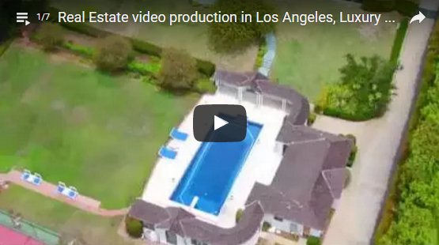

# Sunlight Media

Sunlight Media is a Los Angeles-based web design and internet marketing company, providing quality, stylish and affordable online solutions to a variety of local businesses, corporations, and government organizations. We specialize in custom web and e-commerce development utilizing a broad range of current and emerging web technologies, including WordPress, Joomla!, Magento, HTML5, Drupal, Flash, Zen Cart, CS Cart, Open Cart, custom PHP and custom mobile applications for both iOS and Android.
In addition to our web development, we provide logo design and company branding consultation, video production, product photography, internet marketing and SEO services.

For more information, please visit our [online portfolio](https://sunlightmedia.org).

## Video Production

Here at Sunlight Media we also offer full-service Video Production for both commercial and non-commercial use. Take advantage of our expertise and let your brand stand out from the crowd.

Video is arguably the most effective medium for strengthening your brand and disseminating useful information. If the age-old saying, “a picture is worth a thousand words” is true, how much more is a video worth? With shorter attention spans and people having less patience for reading long text content, video has the capability of getting your message across as succinctly and yet detailed as possible – much more so than what text or images have to offer.

Click below below to view our video reel:

Please visit our website for more information about our [Video Production services](https://sunlightmedia.org/services/video-production-los-angeles/).